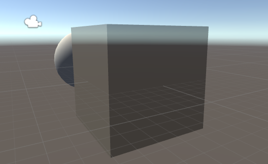
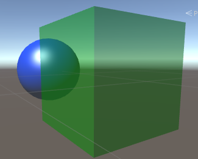
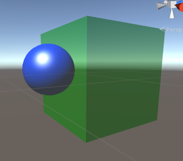
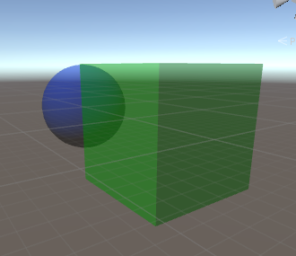
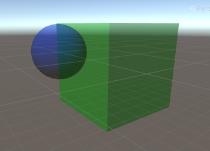

<!-- TOC -->
- [《Unity Shader 入门精要》读书笔记 之 透明效果](#unity-shader-入门精要读书笔记-之-透明效果)
- [参考资料](#参考资料)
- [透明效果](#透明效果)
    - [透明度测试](#透明度测试)
    - [透明度混合](#透明度混合)
        - [深度缓冲](#深度缓冲)
        - [深度写入](#深度写入)
        - [为什么半透明效果要关闭深度写入](#为什么半透明效果要关闭深度写入)
        - [渲染顺序](#渲染顺序)
        - [颜色混合（Blend）](#颜色混合blend)
        - [实现透明度混合的关键步骤](#实现透明度混合的关键步骤)
<!-- /TOC -->
# 《Unity Shader 入门精要》读书笔记 之 透明效果 #
## 参考资料 ##
> 《Unity Shader 入门精要》
## 透明效果
在Unity中，分为两类透明效果，分别是类似镂空效果的**透明度测试**和半透明效果的**透明度混合**。
### 透明度测试
透明度测试应该可以说是伪·透明效果，因为他不能实现半透明效果，而只是对于片元进行选择性裁剪。

透明度测试的关键函数如下：

    clip(x)

当x < 0时，表示裁剪该片元，其原理是应用了discard关键字，上述函数可以还原成下面的代码：

    if(x<0)
        discard;

### 透明度混合
透明度混合效果实现较为复杂，用于实现半透明效果。

其实现涉及到5个概念，深度缓冲（Z-Buff）、深度写入（ZWrite）、渲染顺序（Queue）和颜色混合（Blend）和颜色缓冲。

#### 深度缓冲
深度缓冲用于解决物体的可见性问题。

基于深度缓冲，对于不透明物体，不需要关注他们的渲染顺序也能将其正确的渲染到屏幕。

其原理是：

> 当渲染一个片元时，需要把他的深度值和已经存在于深度缓冲中的值进行比较。
> 如果他的值距离摄像机更远，那么说明这个片元不应该被渲染到屏幕上（说明有物体挡住了它）；否则，此片元应该覆盖掉此时颜色缓冲中的像素值,并把它的深度值更新到深度缓冲中

#### 深度写入
深度写入用于更新深度缓冲。

每次渲染一个片元的时候，将该片元深度值和深度缓冲中的值进行比较，如果当前片元离摄像机更近，那么就进行**深度写入**，将该片元的深度值更新到深度缓冲中。（这样，在深度缓冲中这个像素位置的深度值就被更新到了一个离摄像机更近的值）

#### 为什么半透明效果要关闭深度写入
首先，我们是可以通过一个半透明物体看到它后面的物体的，如果没有关闭深度写入，那么在渲染半透明物体时，因为半透明物体距离摄像机近，而它后面的物体离摄像机远，所以它后面的物体会因为深度测试而被剔除，会出现半透明物体挡住了后面的物体的情况，如下图所示。

只有对半透明物体关闭**深度写入**才能避免这个情况。

> 但是关闭深度写入就破坏了深度缓冲的工作机制,此时渲染顺序就会变得十分重要。

#### 渲染顺序
对于不透明物体，不用关注它们的渲染顺序，依靠深度缓冲，也能将他们按照正确的摆放顺序渲染到场景中。

但是，对于透明物体，渲染顺序就十分重要了，因为半透明物体的渲染需要关闭**深度写入**。

**半透明物体与不透明物体的渲染顺序的问题**

举个例子，物体A（绿色立方体）是半透明物体，物体B（蓝色球体）是不透明物体，其摆放顺序如下图所示（A在前，B在后）。

**先渲染A物体**

如果先渲染A物体，因为A物体是半透明物体（深度写入已关闭），所以此时深度缓冲没有被更新，颜色缓冲被A物体写入，再渲染B物体，此时因为深度缓冲还没有任何有效数据，所以B物体（不透明物体，没有开启混合指令）直接写入深度缓冲和颜色缓冲（直接覆盖掉原本颜色缓冲中的值）。

最后的效果看起来就好像B物体(Queue=2000)在A物体(Queue=1999)前面一样，效果如下图所示。

**先渲染B物体**

如果先渲染B物体，B物体写入深度缓冲和颜色缓冲，再渲染A物体，因为A物体关闭了深度写入而没有关闭深度测试，所以它扔需要与深度缓冲中的值进行比较，发现A物体离摄像机更近，渲染A物体（根据A的透明度和颜色缓冲中B的颜色进行混合）。这样得到的就是正确的半透明效果了。

**半透明物体与半透明物体的渲染顺序的问题**

半透明与不透明物体的渲染顺序错误会造成错误的结果。事实上，半透明与半透明之间的渲染顺序也同样重要。

两个半透明物体在场景中摆放顺序如下，物体A为绿色立方体，物体B为蓝色球体（A在前，B在后）。

**先渲染A物体**

如果先渲染A物体，因为目前深度缓冲中还没有有效数据，所以直接写入颜色缓冲，再渲染B物体，同样因为目前深度缓冲中还没有有效数据，所以直接写入颜色缓冲（同时与前面A物体所写入的颜色缓冲进行混合）。

其渲染效果就好像B物体在A物体前面一样，如下图所示。

**先渲染B物体**

如果先渲染B物体，因为目前深度缓冲中还没有有效数据，所以直接写入颜色缓冲，再渲染A物体，同样因为目前深度缓冲中还没有有效数据，所以直接写入颜色缓冲（同时与前面B物体所写入的颜色缓冲进行混合）。这样得到的就是

**总结**

根据前面所述，因为透明度混合关闭了深度写入，所以渲染顺序变得极其重要，一般来说，规律如下：

1. 先渲染所有不透明物体
2. 根据半透明物体离摄像机的远近进行排序，先渲染离摄像机远的物体

#### 颜色混合（Blend）
仔细思考，之所以可以判断一个物体是透明物体是因为它的什么特征？

**个人认为**，之所以可以判断一个物体是透明物体，是因为可以透过这个物体观察它后面的情况，所以如果要渲染一个透明物体到屏幕上，就一定要知道在透明物体出现之前屏幕这片区域的颜色是怎么样的。

这就用到了颜色缓冲和混合指令，通常来说，可以根据物体的透明度来对物体本身颜色和当前像素区域颜色缓冲区的颜色进行混合，从而得到该透明物体的颜色。这就是颜色混合指令的作用。

>ShaderLab的Blend指令表（来自《Unity Shader入门精要》一书）

语义 | 描述
---|---
Blned Off | 关闭混合
Blend SrcFactor DstFactor | 开启混合，并设置混合因子。最终颜色为 源颜色（该片元的颜色）*SrcFactor + 目标颜色（颜色缓冲区的颜色）*DstFactor
Blend SrcFactor DstFactor,SrcFactorA DstFactorA | 和上面一样，但是使用不同的因子（SrcFactorA和DstFactorA）来混合透明通道
BlendOp BlendOperation | 并非是把源颜色和目标颜色相加后混合，而是使用BlendOperation对他们进行其他操作（乘、减、除）

#### 实现透明度混合的关键步骤

透明度混合用于实现半透明效果，实现透明度混合需要经过下面三个关键步骤。

1. 设置渲染顺序
2. 关闭深度写入
3. 开启混合指令（Blend）

