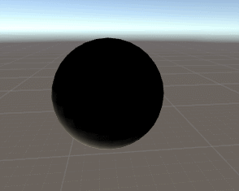
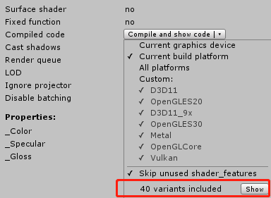

<!-- TOC -->
- [《Unity Shader 入门精要》读书笔记 之 渲染路径、阴影](#unity-shader-入门精要读书笔记-之-渲染路径阴影)
- [参考资料](#参考资料)
- [渲染路径](#渲染路径)
    - [定义](#定义)
    - [前向渲染](#前向渲染)
        - [为什么Addition Pass中要开启混合？](#为什么addition-pass中要开启混合)
        - [什么是逐像素、逐顶点光照](#什么是逐像素逐顶点光照)
        - [如何支持多光源光照？](#如何支持多光源光照)
        - [如何判断光源是逐像素的还是逐顶点](#如何判断光源是逐像素的还是逐顶点)
        - [multi_compile指令](#multi_compile指令)
        - [光照衰减](#光照衰减)
- [阴影](#阴影)
    - [阴影是如何产生的？](#阴影是如何产生的)
    - [如何在Unity3D中实现阴影](#如何在unity3d中实现阴影)
    - [Unity5.x的阴影采样技术](#unity5x的阴影采样技术)
    - [阴影的投射与接收](#阴影的投射与接收)
    - [计算阴影的三个宏命令](#计算阴影的三个宏命令)
        - [SHADOW_COORDS宏](#shadow_coords宏)
        - [TRANSFER_SHADOW宏](#transfer_shadow宏)
        - [TRANSFER_ATTENUATION宏](#transfer_attenuation宏)
<!-- /TOC -->
# 《Unity Shader 入门精要》读书笔记 之 渲染路径、阴影 #
## 参考资料 ##
> 《Unity Shader 入门精要》
> 生成多种着色器程序扩展 https://www.cnblogs.com/leiGameDesigner/p/8458898.html
>游戏里的动态阴影-ShadowMap实现原理 https://www.cnblogs.com/lijiajia/p/7231605.html
## 渲染路径
### 定义
> 渲染路径(Rendering Path)决定了光照是如何应用到Unity Shader中的。

在Shader中通过指定Pass的LightMode标签来设置渲染路径，如果没有设置渲染路径，绘制的图像将会出错，下图是没有设置渲染路径出现的典型错误。

**个人猜测**，因为渲染路径设置错误，所以导致关于光照的变量（_LightColor0,_WorldSpaceLightPos0）错误，最后使得渲染出来的图像出现了奇怪的错误。

Unity中的渲染路径分为以下三种：

1. 前向渲染
2. 延迟渲染
3. 顶点渲染（已逐步废弃）

其中前向渲染是最常用的渲染路径。

### 前向渲染
前向渲染有两种Pass，Base Pass和Additional Pass。

Base Pass用于处理一个逐像素的平行光以及所有逐顶点和SH光源。

Additional Pass用于处理其他影响该物体的逐像素光源，每个光源执行一次Pass。

#### 为什么Addition Pass中要开启混合？
在Additional Pass中开启混合指令（一般为Blend One One）主要是为了将多个逐像素光源渲染的结果叠加起来。

如果没有开启混合指令，那么后面的光源将会覆盖前面光源的效果，表现出来就是，物体只受到了一个光源的作用。

#### 什么是逐像素、逐顶点光照
逐xx光照实际上表示的是，物体受到光照时，执行的是逐像素的计算还是逐顶点的计算。

这样说可能有点不太明朗，下面上代码。

· 这是逐顶点光照，即光照计算全在顶点着色器中进行

    // 光照是在顶点计算的Shader
    Shader "Volume xx/Other/Vertex Light" {
        Properties {
            _Color("Color Tint",Color) = (1, 1, 1, 1) 
        }
        SubShader {
            Tags { "RenderType"="Opaque" "Queue"="Geometry" }
            Pass {

                Tags { "LightMode"="ForwardBase" }

                CGPROGRAM
                
                #include "Lighting.cginc"

                #pragma vertex vert
                #pragma fragment frag

                fixed4 _Color;

                struct a2v{
                    float4 vertex : POSITION;
                    float3 normal : NORMAL;
                };
                struct v2f{
                    float4 pos : SV_POSITION;
                    fixed4 color : COLOR;
                };

                v2f vert(a2v v){
                    v2f o;
                    o.pos = UnityObjectToClipPos(v.vertex);

                    float3 worldPos = mul(unity_ObjectToWorld,v.vertex).xyz;
                    fixed3 worldNormal = normalize(UnityObjectToWorldNormal(v.normal));
                    
                    fixed3 worldLightDir = normalize(UnityWorldSpaceLightDir(worldPos));

                    // 计算漫反射光照
                    fixed3 diffuse = _Color.rgb * _LightColor0.rgb * max(0,dot(worldLightDir,worldNormal));

                    o.color = fixed4(diffuse,1.0);

                    return o;
                }        

                fixed4 frag(v2f i) : SV_TARGET{
                    return i.color;
                }

                ENDCG
            }
        }
        FallBack "Diffuse"
        
    }

---
· 下面是逐像素（片元）光照，即光照计算全在片元着色器中进行

    // 光照是在顶点计算的Shader
    Shader "Volume xx/Other/Fragment Light" {
        Properties {
            _Color("Color Tint",Color) = (1, 1, 1, 1) 
        }
        SubShader {
            Tags { "RenderType"="Opaque" "Queue"="Geometry" }
            Pass {

                Tags { "LightMode"="ForwardBase" }

                CGPROGRAM
                
                #include "Lighting.cginc"

                #pragma vertex vert
                #pragma fragment frag

                fixed4 _Color;

                struct a2v{
                    float4 vertex : POSITION;
                    float3 normal : NORMAL;
                };
                struct v2f{
                    float4 pos : SV_POSITION;
                    float3 worldNormal : TEXCOORD0;
                    float3 worldPos : TEXCOORD1;                
                };

                v2f vert(a2v v){
                    v2f o;
                    o.pos = UnityObjectToClipPos(v.vertex);

                    o.worldPos = mul(unity_ObjectToWorld,v.vertex).xyz;
                    o.worldNormal = UnityObjectToWorldNormal(v.normal);

                    return o;
                }        

                fixed4 frag(v2f i) : SV_TARGET{
                    fixed3 worldNormal = normalize(i.worldNormal);
                    fixed3 worldLightDir = normalize(UnityWorldSpaceLightDir(i.worldPos));

                    fixed3 diffuse = _Color.rgb * _LightColor0.rgb * max(0,dot(worldNormal,worldLightDir));

                    return fixed4(diffuse,1.0);
                }

                ENDCG
            }
        }
        FallBack "Diffuse"
        
    }

对于前向渲染的Base Pass来说，他处理场景中的一个逐像素的平行光和所有逐顶点、SH（球谐函数，表示暂时不是很理解，此处待补充）光源，这表示的意思可以简单概括如下：

即，逐像素的平行光使得场景内物体都会执行一次逐像素光照计算（如果有在片元着色器计算的话），所有顶点光照的物体（即光照计算在Vertex Shader中的物体）也会进行逐顶点光照计算。

#### 如何支持多光源光照？
如果在前向渲染只使用一个Base Pass，那么它就只能支持一个平行光和其他逐顶点光源，而无法支持多个逐像素光照的情况。

在Base Pass的前提下，在增加一个Additional Pass则可以为物体增加多光源光照的效果。

在Additional Pass中设置渲染路径为LightMode = ForwardAdd和开启混合模式，再将处理顶点光照计算的部分删除，剩余代码跟BasePass一致，就可以达到多光源的效果了。

#### 如何判断光源是逐像素的还是逐顶点
规律如下：

1. 场景中最亮的平行光按逐像素处理
2. 渲染模式设置为Not Important的光源，按逐顶点或SH处理
3. 渲染模式被设置为Important的光源，按逐像素处理
4. 如果根据以上规则得到的逐像素光源数量小于Quality Setting中的逐像素光源数量，会有更多的光源以逐像素的方式进行渲染。

#### multi_compile指令
>Unity中使用multi_compile指令为相应类型的Pass生成所有需要的Shader变种。这些变种会处理不同条件下的渲染逻辑，例如是否使用光照贴图、当前处理那种光源类型、是否开启阴影、光照衰减值的获取。

使用该编译指令需要**谨慎**，因为该指令会大大增加Unity项目的体积，它会生成多个Shader变种。

下图为multi_compile_fwdbase和multi_compile_fwdadd指令生成的shader变种数量，多达40种。

其中用于前向渲染的指令描述如下：

指令 | 描述
---|---
multi_compile_fwdbase | 编译所有Pass类型为ForwardBase 的shader变体。这些变体会处理不同的光线映射类型和主平行光是否有阴影。
multi_compile_fwdadd | 编译所有Pass类型为ForwardAdd 的shader变体。这些编译变体用来处理平行光、聚光和点光类型，并且他们的变体会烘焙贴图。
multi_compile_fwdadd_fullshadows | 与上面的一致，但是还包含了光源实时阴影的处理。
multi_compile_fog | 扩展了几个变体来处理不同的雾类型

#### 光照衰减
平行光没有位置属性，只有方向属性，所以平行光不存在衰减问题。

对于点光源、聚光灯来说，光照强度会随着物体距离他们的距离的变化而改变。

光照衰减值可以采用数学公式计算，但这样会在Shader里出现大量计算，同时无法在Shader中通过内置变量获得**光源的范围、聚光灯的朝向、张开角度等**信息，所以直接采用数学公式计算衰减值不太现实。

Unity使用一张纹理_LightTexture0来在片元着色器中查找逐像素光照的衰减值。

_LightTexture0纹理中对角线上的纹理颜色值表示在光源空间中不同位置的点的衰减值。如（0，0）表示与光源位置重合的点的衰减值，（1，1）表示在光源空间中最远的一点的衰减值。

为了得到给定点在光源中的衰减值，需要将该点通过_LightMatrix0矩阵变换到光源空间来对光照衰减纹理进行采样。

计算衰减值（点光源的衰减值，聚光灯需要另外讨论）的代码如下：

    fixed atten = tex2D(_LightTexture0,dot(lightCoord,lightCoord).rr).UNITY_ATTEN_CHANNEL;

上面的代码使用光源空间中顶点(lightCoord)距离的平方来对纹理进行采样，没有用距离值采样是因为可以避免开方。

## 阴影
### 阴影是如何产生的？
> 当一个光源发射的一条光线遇到一个不透明物体时，这条光线就不可以继续照亮其他物体。因此，这个物体就会向他旁边的物体投射阴影，阴影区域的产生就是因为光纤无法到达这些区域。
### 如何在Unity3D中实现阴影
Unity3D使用阴影映射纹理ShadowMap来实现阴影，它实际上就是一张深度图，由一个额外的Pass渲染。

阴影映射纹理的原理如下：

1. 将摄像机位置变到光源位置（方向、位置等与光源一致），此时摄像机看不到的地方就是光源的阴影区域。在这里渲染一张深度图作为阴影映射纹理。
2. 当一个物体要接受阴影时，它会向上一步拿到的深度图进行采样，同时比较当前顶点的深度是否大于深度图（阴影映射纹理）中的深度，如果大于，说明该顶点虽然在屏幕空间内可见，但是是阴影区域。

### Unity5.x的阴影采样技术
> Unity5中，使用了不用于上面那种传统的阴影采样技术，即屏幕空间的阴影映射技术。
> 当使用了屏幕空间的阴影映射技术时，Unity首先会通过调用LightMode为ShadowCaster的Pass来得到可投射阴影的光源的阴影映射纹理以及摄像机的深度纹理。然后，根据光源的阴影映射纹理和摄像机的深度纹理来得到屏幕空间的阴影图。如果摄像机的深度图中记录的表面深度大于转换到阴影银蛇纹理中的深度值，就说明该表面虽然是可见的，但是却处于该光源的阴影中。

### 阴影的投射与接收
综上所述，物体要接收阴影，就必须在Shader计算中向阴影映射纹理进行采样，根据采样后的结果来产生阴影效果。

物体要向其他物体投射阴影，自身要加入阴影映射纹理（也就是深度图）的计算，简要的说，就是，该物体得在深度图中记录有它的深度，这样其他物体在接受阴影时，才能根据这个深度判断会不会产生阴影。

### 计算阴影的三个宏命令
手动实现阴影效果较为麻烦，Unity提供了一些宏命令，可以方便的计算阴影映射纹理、阴影映射纹理的采样坐标、对阴影映射纹理采样后还要经过的一系列计算（深度比较）。

#### SHADOW_COORDS宏
在AutoLight.cginc中，该宏定义如下：

    #define SHADOWS_COORDS(idx1) unityShadowCoord4 _ShadowCoord : Texcoord##idx1;

简单来说，就是声明了对阴影映射纹理进行采样的坐标，这个坐标在vertex Shader中进行计算。

#### TRANSFER_SHADOW宏
在AutoLight.cginc中，该宏定义如下：

    #if defined(UNITY_NO_SCREENSPACE_SHADOWS)    
        #define TRANSFER_SHADOW(a) a._ShadowCoord = mul(unity_World2Shadow[0],mul(_Object2World,v.vertex));
        inline fixed unitySampleShadow (unityShadowCoord4 shadowCoord){
            ....
        }
    #else
        #define TRANSFER_SHADOW(a) a._ShadowCoord = ComputeScreenPos(a.pos);
        inline fixed unitySampleShadow (unityShadowCoord4 shadowCoord){
            fixed shadow = tex2Dproj(_ShadowMapTexture,UNITY_PROJ_COORD(shadowCoord)).r;
            return shadow;
        }
    #endif

有两种情况：

1. 使用传统对阴影映射纹理采样的方法：将当前顶点变换到光源空间后储存到_ShadowCoord中。（随后可以根据这个变换后的坐标对阴影映射纹理采样，得到当前顶点坐标在光源空间中的深度，与当前顶点的深度进行比较）
2. 使用屏幕空间的阴影映射技术：将当前顶点变换到屏幕坐标后存储到_ShadowCoord中。

#### TRANSFER_ATTENUATION宏
在AutoLight.cginc中，该宏定义如下：
    
    #define SHADOW_ATTENUATION(a) unitySampleShadow(a._ShadowCoord)

表示使用上面TRANSFER_SHADOW生命的函数unitySampleShadow来计算阴影。