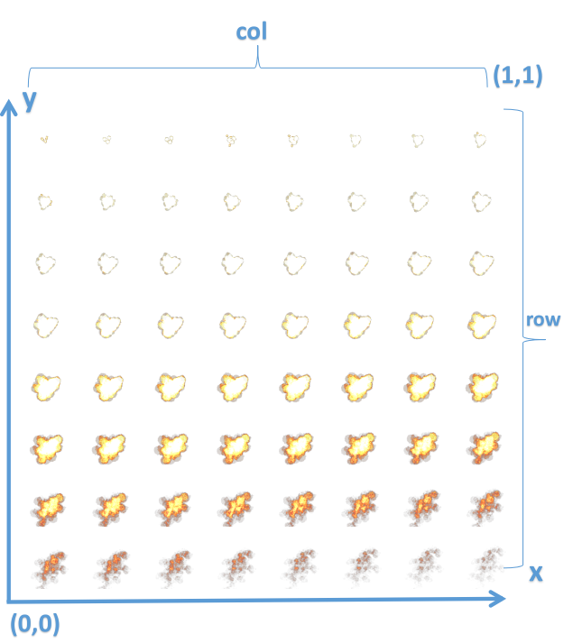
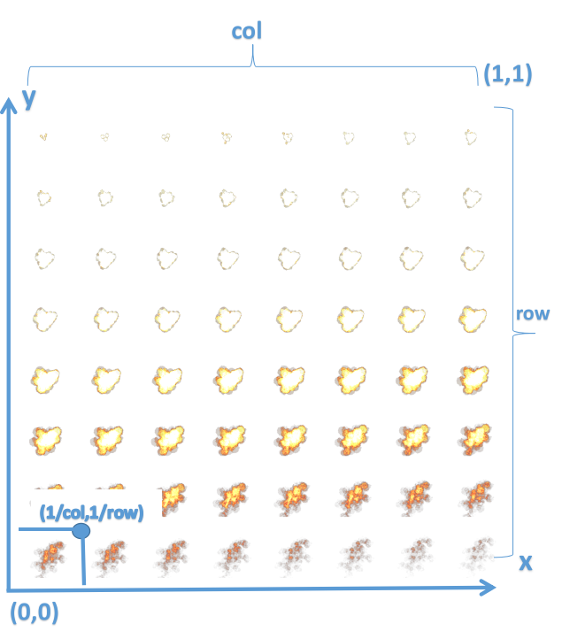

# 《Unity Shader 入门精要》读书笔记 之 顶点变换与_Time变量的使用 #
## 参考资料 ##
> 《Unity Shader 入门精要》
## 序列帧动画
> 最常见的纹理动画就是序列帧动画。序列帧动画的原理非常简单，它像放电影一样，依次播放一系列关键帧图像，当播放速度达到一定数值时，看起来就是一个连续的动画。

一般来说，2D游戏中用的序列帧动画次数比较多，一个常见的序列帧图片如下图所示（来自《Unity Shader入门精要》）。

### 实现
在Shader中实现序列帧还是比较简单的，基本思路就是利用_Time变量，随着时间的变换，不停的变化uv，导致看起来像播放动画一样。

基本思路如下：
根据序列帧的图片，我们设col为图片有多少列，row为图片有多少行，那么一共有col*row个关键帧图片。

那么在实际操作时，就需要把uv分成col*row份，也就是说，uv的范围实际上从(0,0)~(1,1)变换到了(0,0)~(1/col,1/row)。

一个比较形象的示意图如下：

简而言之，我们在frag Shader里得到的uv，x分量要除于col,y分量要除于row,这样,uv就转换到了正确的范围.

但是,这还不够,这样的画,uv只是在序列帧图片的第一幅图上而已,我们要把这个uv平移到我们要到的第N张图上

假设这第N张图的行数是RowN,列数是ColN,那么uv要加上(colN/col,rowN/row),这样才能正确的平移到目标图片上。

假设是第3行第四列的图上，如下图所示，可以看到要平移的部分。

需要注意的是，这张序列帧图片关键帧的顺序是从左到右，从上到下，所以对于uv的y分量，应当减去才是向下一个关键帧前进，如果改为加法，是向上一个序列帧前进。

如上图所示，如果要到达第三行第四列的位置，那么要进行以下操作。

1. 当前uv.x /= col,当前uv.y /= row;
2. 当前uv.x += 4/col,当前uv.y -= 3/row。要不然y也可以加上(row-3)/row,不过对这个分式简化之后也可以发现其实也就是前面那个-3/row
3. 此时uv正确移动到了目标关键帧的位置

### 步骤
那么实现序列帧动画的基本步骤如下：

1. 根据_Time变量确定当前要播放第几行第几列的关键帧
2. 将当前uv根据上面的操作移动到目标关键帧的那个图像范围内
3. 根据uv对图像进行采样

这样，就能简单实现序列帧动画了。